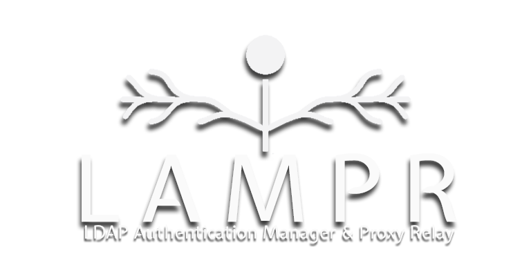

# LAMPR - LDAP Authentication Manager & Proxy Relay



[](LICENSE)
[](https://kotlinlang.org/)
[](https://adoptium.net/)

LAMPR is a powerful LDAP authentication manager and proxy relay designed to simplify and enhance the management of one-to-many LDAP relationships. It efficiently handles secure connections, removing complexity and load from upstream applications.

LAMPR utilizes Kotlin Multiplatform (KMP), an open-source technology developed by JetBrains for flexible cross-platform development, targeting desktop and server environments within this application.

* `/composeApp` is for code that will be shared across your Compose Multiplatform applications.
  It contains several subfolders:
  - `commonMain` is for code that’s common for all targets.
  - Other folders are for Kotlin code that will be compiled for only the platform indicated in the folder name.
    For example, if you want to use Apple’s CoreCrypto for the iOS part of your Kotlin app,
    `iosMain` would be the right folder for such calls.

* `/server` is for the Ktor server application.

* `/shared` is for the code that will be shared between all targets in the project.
  The most important subfolder is `commonMain`. If preferred, you can add code to the platform-specific folders here too.


Learn more about [Kotlin Multiplatform](https://www.jetbrains.com/help/kotlin-multiplatform-dev/get-started.html)…

## Features

- One-to-many LDAP relationship management.
- Secure and efficient proxy relay for LDAP authentication.
- User-friendly application interface for connection management.

## Getting Started

### Prerequisites

- [Java 17](https://adoptium.net/)
- [MariaDB 11](https://mariadb.org/)
- At least 1 LDAP server

### Installation

#### Clone the repository:
```bash
git clone https://github.com/TheKDub/LAMPR.git
cd LAMPR
```

#### More information coming soon!

### License
All Rights Reserved © 2024 TheKDub

This project is proprietary and confidential. Unauthorized copying, transferring, or reproduction of its contents in any medium is strictly prohibited.

The software is provided "AS IS", without warranty of any kind. The authors or copyright holders shall not be liable for any claim, damages, or liability arising from the software.

For more details, refer to the [LICENSE](LICENSE) file.